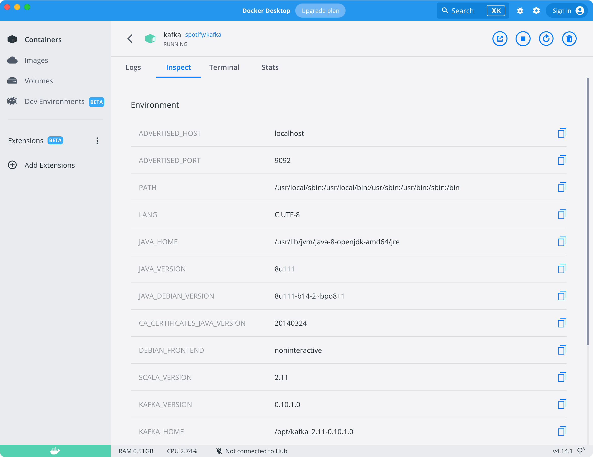
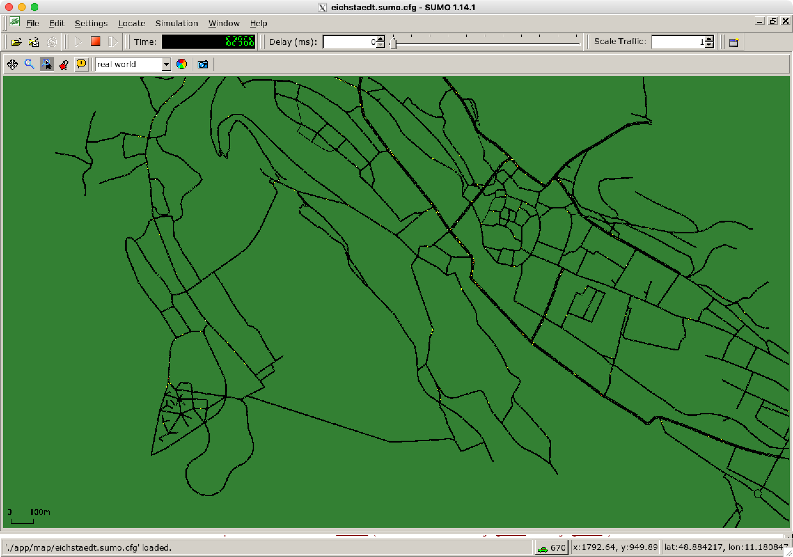

# Setup for Local Development with Docker Desktop

1. Install [Docker Desktop](https://www.docker.com/products/docker-desktop/).
2. Install SUMO according to the [guide](https://sumo.dlr.de/docs/Installing/index.html).
3. Install Kafka by running
   ```shell
   docker run --name kafka --hostname kafka -p 2181:2181 -p 9092:9092 --env ADVERTISED_HOST=kafka --env ADVERTISED_PORT=9092 spotify/kafka
   ```
4. Download and install dependencies with **Python 2.7** in [CrowdNav](https://github.com/imchell/CrowdNav).
5. Make sure spotify/kafka is running in Docker.
   
6. Run `python run.py` in CrowdNav. The terminal will prompt
   ```shell
   #####################################
   #      Starting CrowdNav v0.2       #
   #####################################
   # Configuration:
   # Kafka-Host   -> localhost:9092
   # Kafka-Topic1 -> crowd-nav-trips
   # Kafka-Topic2 -> crowd-nav-performance
   # StreamForword OK!
   # KafkaConnector OK!
   # SUMO-Dependency check OK!
   # Map loading OK! 
   # Nodes: 426 / Edges: 1131
   
   Retrying in 1 seconds
   Could not connect to TraCI server at localhost:63396 [Errno 61] Connection refused
   
   # SUMO-Application started OK!
   # Start adding initial cars to the simulation
   0 -> Step:100 # Driving cars: 742/750 # avgTripDuration: 0(0) # avgTripOverhead: 0
   0 -> Step:200 # Driving cars: 745/750 # avgTripDuration: 0(0) # avgTripOverhead: 0
   0 -> Step:300 # Driving cars: 745/750 # avgTripDuration: 214.888888889(26) # avgTripOverhead: 2.29300312373
   0 -> Step:400 # Driving cars: 743/750 # avgTripDuration: 263.967741935(61) # avgTripOverhead: 2.12040051211
   ```
   A program called XQuartz shows up simultaneously.
   
7. Download and install dependencies with **Python 3.7+** in [RTX](https://github.com/imchell/RTX).
8. Run `python rtx.py start examples/crowdnav-sequential` in RTX folder. The terminal will prompt
   ```shell
   > Starting RTX experiment...
   ######################################
   > Workflow       | CrowdNav-Sequential
   > KafkaProducer  | JSON | URI: localhost:9092 | Topic: crowd-nav-commands
   > KafkaConsumer  | JSON | URI: localhost:9092 | Topic: crowd-nav-trips
   sequential
   > ExecStrategy   | Sequential
   >
   > IgnoreSamples  | [##############################] Target: 100 | Done: 100  
   > CollectSamples | [##############################] Target: 100 | Done: 100
   > Statistics     | 1/4 took 44796ms - remaining ~134.388sec
   > FullState      | {'count': 100, 'avg_overhead': 2.466326980805825}
   > ResultValue    | 2.466326980805825
   ```